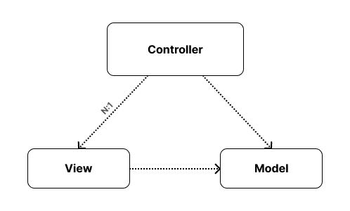

# MVC

MVC 패턴은 `Model - View - Controller`의 구성요소를 가지고 있는 디자인 패턴입니다.

### Q. MVC의 등장 배경은 무엇인가요?
소프트웨어 시스템이 복잡해지면서 **사용자 인터페이스와 비즈니스 로직을 분리**하는 것이 중요해져 가독성을 높이고 유지보수를 쉽게 하기 위해 MVC 패턴을 고안하게 되었습니다.

### MVC 특징
- Controller와 View는 일반적으로 1:N 관계이나(하나의 Controller에 여러 View 연결), Android에서 Activity or Fragment를 Controller로 보는 경우 1:1 관계가 된다.
    - 여기서 View는 버튼, 텍스트뷰를 의미하기 보다는 하나의 화면을 의미하기 때문에 1:1 관계로 표현된다.  

**[단점]**  
- 프로젝트 규모가 커질수록 Controller의 역할이 많아진다.
  - 역할: 어떤 View에 어떤 Data를 보여줄 것인지, 사용자 입력 이벤트 처리 등
- Controller는 View에 대한 의존성을 가지고 있어 결합도가 높아 테스트 및 유지보수에 어려움이 있다.
  - View 변경 시 Controller도 변경해야한다.
  - Controller의 특정 비즈니스 로직을 테스트하고 싶은데, 해당 로직과 관련없는 특정 View가 필요하다.

### Model
- **데이터를 관리**하고, 데이터 관련 **비즈니스 로직을 처리**하는 부분
- 원격 및 로컬 데이터를 수집하고 처리하는 부분

### View
- 사용자에게 보여지는 **UI 화면**을 담당하는 부분
- Controller에게 전달받은 데이터로 UI 업데이트
- Android에서 XML을 의미

### Controller
- **사용자의 요청**을 받는 부분
- View와 Model 사이에서 사용자의 요청을 전달하고 데이터를 주고 받는 **중재자 역할**
- Activity or Fragment를 의미

### MVC 의존 관계

- Model: 독립적이다.
- View: Model의 의존성을 가진다.
- Controller: View와 Model의 의존성을 가진다.

### MVC 데이터 흐름

### Q. Android에서 MVC 패턴을 적용하면 Activity or Fragment는 View와 Controller 중 어떤 요소에 해당되나요?
관점에 따라 달라집니다. Activity or Fragment는 사용자의 요청을 받기 때문에 Controller로 볼 수도 있고 xml과 Activity or Fragment를 모두 View로 보고 새로운 Controller 클래스를 생성할 수도 있습니다. 하지만, 이와 같은 방식으로 구현한다면 불필요한 코드가 많이 발생하여 Activity or Fragment를 Controller로 보는 것이 더 나은 관점이라고 생각합니다.